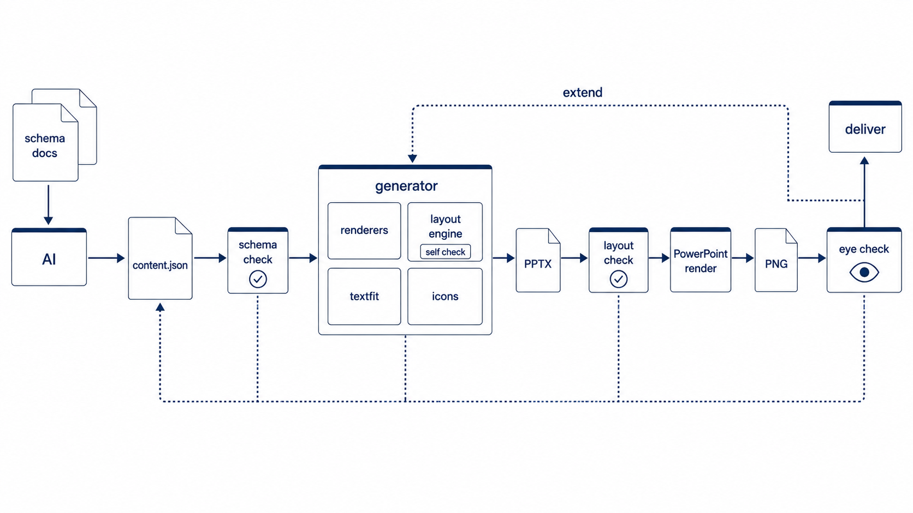

# アーキテクチャと品質保証

## 文書の目的

この文書は、`slide-gen-lab`がスライド内容とレイアウトをどのように分離し、提出可能な品質を
どの段階で保証するかを説明する。対象読者は、rendererやレイアウトエンジンを設計・変更する開発者と生成AIである。

新しいデッキを作る利用手順は[README](../README.md)、`content.json`の仕様は
[CONTENT_SCHEMA.md](../CONTENT_SCHEMA.md)、新しいtypeを実装する具体的な手順は
[EXTENDING.md](../EXTENDING.md)を参照する。

## 全体像

処理は次の順序で進む。

1. 人間または生成AIが、資料要件を`content.json`へ構造化する。
2. `validate_content.py`がtypeごとの必須項目、件数、値の整合性を検証する。
3. `generate_from_json.py`がtypeに対応するrendererを選択する。
4. rendererまたは専用レイアウタが、座標・余白・フォント・描画順を決定してPPTXを生成する。
5. `check_layout.py`が、重なり・枠線貫通・スライド外へのはみ出しを機械検査する。
6. `render.ps1`がPowerPointでPNG化し、機械検査では判定できない見た目を確認する。
7. 不合格の場合は、内容の問題なら`content.json`、表現力の問題ならrendererまたはレイアウタへ戻す。

## 設計目標

- 同じ入力から同じPPTXを生成できる決定論的な処理にする。
- 生成AIに座標・サイズ・余白・フォント値を決めさせない。
- 日本語の折り返しと禁則をPowerPoint任せにせず、配置前に計算する。
- 新しい表現を追加しても、既存typeの配置品質を変えない。
- 機械検査と実レンダリング確認の両方を通過した成果物だけを完成扱いにする。

## 非目標

- 1つのレイアウトアルゴリズムですべてのスライドジャンルを表現すること。
- `content.json`へ座標やピクセル単位の調整値を追加して、個別スライドだけを成立させること。
- PowerPointの自動調整だけに依存して、テキストの収まりを保証すること。
- `check_layout.py`の合格だけで、色・余白・視線誘導を含むデザイン品質を保証すること。

## 責務境界

| 担当 | 入力 | 決定する内容 | 決定しない内容 |
|---|---|---|---|
| 人間・生成AI | 資料要件、情報源 | 文言、項目、type、要素間の意味的な関係 | 座標、余白、フォント、描画順 |
| schema validator | `content.json` | 必須項目、件数、型、参照整合性の合否 | 見た目、座標 |
| renderer | 検証済みのslide spec | スライドジャンル固有の構成と描画 | 他ジャンルの配置規則 |
| レイアウトエンジン | 離散的な構造仕様 | 座標、ポート、配線、圧縮、描画順 | 資料の主張や文言 |
| 品質ゲート | PPTX、PNG | 衝突、はみ出し、禁則、視認性の合否 | 内容の正しさ |

この境界により、生成AIの違いが座標品質へ直接影響しない。AIが変更できるのは構造化された内容までで、
配置結果はコードと入力schemaによって決まる。

## レイヤーモデル

実装は4つの層に分けて考える。

| 層 | 責務 | 主な実装 | 再利用範囲 |
|---|---|---|---|
| L0 測定・描画部品 | 文字計測、収容候補の選択、矩形、線、矢印、アイコン、ラベル | `textfit.py`、`layout_fit.py`、`generate.py`、`diagrams.py` | 全type |
| L1 レイアウト計算 | ジャンル固有の位置・サイズ・配線計算 | `diagram_layout.py`、`diagrams2.py`、各renderer | 同一ジャンル内 |
| L2 入力境界 | schema、入力検証、renderer選択 | `CONTENT_SCHEMA.md`、`validate_content.py`、`generate_from_json.py` | 全type |
| L3 品質保証 | PPTX検査、PNG化、一覧確認 | `check_layout.py`、`render.ps1`、`contact_sheet.py` | 全type |

共通化の中心はL0、L2、L3である。L1はグリッド、ガント、散布、縦詰め、ツリー、放射など、
制約の種類ごとに異なるため、ジャンルを越えて無理に統合しない。

## レイアウタ・カタログ方式

カタログの単位はrenderer関数の数ではなく、独立した制約を持つスライドジャンルである。

例えば、グリッド構成図ではノードの行列、コンテナ境界、接続ポート、直角配線を計算する。
ロードマップでは期間軸、バーの始点と終点、判定ポイントを計算する。組織図では親子関係と
階層間隔を計算する。これらを1つのアルゴリズムへ統合すると、設定項目と例外分岐が増え、
各ジャンルで保証すべき条件が不明確になる。

新しい表現を追加するときは、次の基準で実装先を決める。

| 要件 | 実装方針 |
|---|---|
| 既存typeの文言・件数・色の範囲で表現できる | 既存schemaとrendererを使う |
| 同じ制約モデルで、離散的な語彙を1つ追加すれば表現できる | 既存レイアウタを拡張する |
| 座標を直接指定しないと既存レイアウタへ収まらない | 新しいジャンル専用レイアウタを検討する |
| 複数の異なる題材で同じ配置規則を再利用できる | 新しいtypeとしてカタログへ追加する |
| 1枚だけに必要な装飾で再利用条件を説明できない | type追加ではなく資料固有の要件を見直す |

判断に迷う場合は、異なる題材の例を2から3枚用意し、既存の仕様語彙だけで記述できるか確認する。
座標やサイズの数値を入力へ追加しないと成立しない場合は、入力側ではなくレイアウタ側の不足として扱う。

## 品質保証の仕組み

### 配置前のテキスト実測

`textfit.py`は游ゴシックの実寸をPillowで測り、指定幅での折り返し行数と必要高さを計算する。
rendererは計測結果を使ってフォントサイズまたは配置領域を決めてからテキストを置く。

日本語では、句読点が行頭へ出ないように折り返し位置を調整する。PowerPoint側でも禁則が働くように、
日本語runへ`lang="ja-JP"`を設定する。計測と描画で異なるフォントや行間を使ってはならない。

### 段階的な収容ポリシー

全rendererは描画前に必要量を測り、次の順序で収容候補を評価する。

1. 標準の余白・文字・図形サイズを使う。
2. 要素の可読性に必要な間隔は残し、裁量余白やパディングだけを圧縮する。
3. renderer固有の視覚要素を、縦横比を維持したまま文書化済みの最小値まで縮小する。
4. 最小値でも収まらなければ`FitError`で生成を停止し、不足量と対処方法を返す。

候補選択と停止形式は`layout_fit.py`で共有する。一方、何を裁量余白とするか、アイコン・文字・行高の
どれをどこまで縮小できるかはジャンル固有の設計判断なので、各rendererまたはL1レイアウタが持つ。
最小サイズへ黙って固定して溢れたまま描画する処理や、PowerPointの自動縮小への委譲は禁止する。

### 自然高さパッキング

箇条書きやカードの高さは、要素数だけで均等分割せず、実測した文字高さと一定gapから決める。
余った領域は要素間へ均等配分せず、まとまりを保ったまま上寄りに配置する。これにより、情報量が
少ないスライドで余白が不自然に分断されることを防ぐ。

### 図解の配置と配線

`diagram` typeは、列・行・ノード・コンテナ・エッジを入力として受け取り、`diagram_layout.py`が
座標を計算する。ノードは接続辺ごとのポートを持ち、エッジは明示されたチャネルを通る直角経路として
描画される。エンジンはコンテナ境界貫通、逆向き区間、短すぎる終端などを描画前に検査する。

### 段階的な品質ゲート

| 段階 | 検査対象 | 検出できる問題 | 検出できない問題 |
|---|---|---|---|
| schema検証 | `content.json` | 必須項目不足、件数超過、不正な参照、廃止type | 見た目、意味の正しさ |
| エンジン自己検証 | レイアウト計算結果 | 配線方向、境界貫通、区間長、領域不足 | 色、文字の視認性 |
| PPTX機械検査 | 生成済みPPTX | テキスト衝突、画像衝突、枠線貫通、はみ出し | 線同士の交差、Z順、印象 |
| PNG目視 | PowerPoint描画結果 | 禁則、コントラスト、余白、視線誘導、線の見え方 | 情報源の正確性 |
| 内容確認 | 原情報とスライド | 誤記、根拠不足、対象読者との不一致 | 内部座標の妥当性 |

機械検査の合格は必要条件であり、完成条件ではない。PowerPointの描画結果をPNGで確認し、
デザインと内容の確認を終えた時点で完成とする。

## 生成AIへの依存度

| 作業 | モデル依存度 | 理由 |
|---|---|---|
| 資料要件から文言と構造を作る | 低から中 | schemaに従えるモデルであれば実行できるが、内容品質は入力情報に依存する |
| 既存typeからPPTXを再生成する | なし | rendererとレイアウタが決定論的に処理する |
| 新しいレイアウタを実装する | 中 | 制約分解、既存部品の理解、回帰検証が必要になる |
| PNGからデザイン欠陥を見つける | 高 | 画像を読めるモデルまたは人間の確認が必要になる |
| 情報の正しさを承認する | AIだけでは不可 | 原情報を持つ責任者の確認が必要になる |

## 変更時の参照先

| 変更内容 | 参照文書 |
|---|---|
| `content.json`を作る | [AI_DECK_PROMPT.md](../AI_DECK_PROMPT.md)、[CONTENT_SCHEMA.md](../CONTENT_SCHEMA.md) |
| 新しいtypeや図解機能を追加する | [EXTENDING.md](../EXTENDING.md) |
| 配色、表紙、既存rendererのデザインを変更する | [DESIGN_CUSTOMIZATION.md](../DESIGN_CUSTOMIZATION.md) |
| 表紙・フッターだけをユーザー別に設定する | [cover-footer-customization.md](cover-footer-customization.md) |
| 開発フローとマージ条件を確認する | [AGENTS.md](../AGENTS.md) |

設計を変更した場合は、実装だけでなくschema、validator、ギャラリー、品質ゲート、関連文書を
同じ変更単位で更新する。
